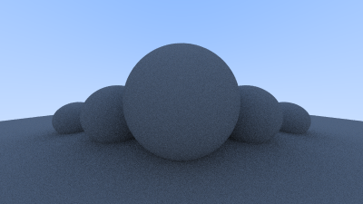

# Ray tracing learning project

A small C++ implementation developed while working through Peter Shirley's [*Ray Tracing in One Weekend*](https://raytracing.github.io/books/RayTracingInOneWeekend.html), used to learn ray-sphere intersections, camera rays, sampling and recursive diffuse light transport.



This preview is a PNG conversion of the existing [PPM render](renders/a.ppm), not a new benchmark or a claim of original rendering research.

## Scope

The code follows the book closely; the core design and algorithms are credited to Peter Shirley and the [upstream project and contributors](https://github.com/RayTracing/raytracing.github.io).

Implemented: sphere intersections, nearest-hit traversal over a list, a perspective camera, jittered pixel sampling, recursive hemisphere scattering for diffuse surfaces, a sky gradient, and plain-text PPM output. The current scene places five small spheres above a ground sphere.

This is an early learning snapshot, not a complete implementation of the book. It has no metal/glass material system, textures, acceleration structure or gamma correction. The camera setup and scene are configured directly in the source.

## Build and run

A C++11 compiler and the standard library are sufficient; no external rendering library or CMake setup is required. From the repository root:

```sh
mkdir -p build
c++ -std=c++11 -O2 -Wall -Wextra -Wpedantic main.cpp -o build/raytracer
./build/raytracer > render.ppm
```

Image data goes to standard output; progress messages go to standard error. Open `render.ppm` in a PPM-capable viewer. The default render is 400×225 pixels with 100 samples per pixel and a maximum recursion depth of 50; these settings are in `main.cpp`.

## Files and verification

`camera.h` generates rays and renders the scene. `sphere.h`, `hittable.h` and `hittable_list.h` implement intersections. The remaining headers provide vectors, rays, intervals, color output and book-style helpers.

Verified with Apple Clang 15 using C++11 and warning flags. A full default render completed and its PPM dimensions and pixel values were checked. There is no test suite or performance benchmark; other toolchains have not been verified.

## Attribution

The upstream book/project is distributed under CC0 1.0 Universal. Its notice is reproduced in [docs/third-party/RTOW-CC0.txt](docs/third-party/RTOW-CC0.txt), retrieved from [upstream COPYING.txt](https://github.com/RayTracing/raytracing.github.io/blob/release/COPYING.txt). This preserves upstream terms; no new license has been selected for project-specific changes.
